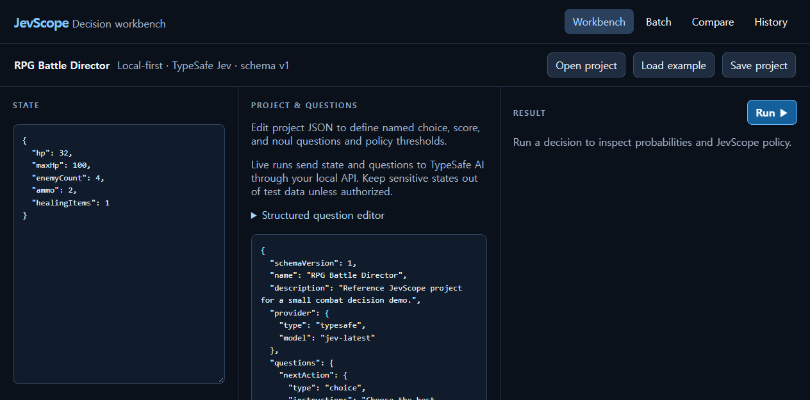

# JevScope

Local-first decision workbench and regression testbench for [TypeSafe AI Jev](https://typesafe.ai/). JevScope lets you edit structured state and `choice`, `score`, or `noul` questions; inspect answers and probability distributions; run JSONL cases; compare two project definitions; and check explicit expectations.

**Status:** v0.1 workbench. A TypeSafe API key is required for live evaluation. [Project overview](https://jeiel85.github.io/jevscope/) · [Design documents](docs/00-product-brief.md)



The [batch view](docs/batch-workbench.png) and [compare view](docs/compare-workbench.png) are also available in the local Studio.

## Quick start

Requirements: Node.js 20+ and pnpm.

```bash
git clone https://github.com/jeiel85/jevscope.git
cd jevscope
cp .env.example .env
# Edit .env and set TYPESAFE_API_KEY
pnpm install
pnpm dev
```

Open the Studio at <http://localhost:5173>. The API listens on <http://127.0.0.1:4317>. Check configuration at `GET /health`. The Studio includes a sample game AI project and JSONL cases; `pnpm validate:example` validates the bundled project.

## What you can do

- **Workbench:** open, edit, validate, and export a `.jevscope.json` project; edit JSON state; run named questions; inspect per-question results and raw response.
- **Decision policy:** set `auto` and `review` confidence thresholds for choices and scores, and YES/NO thresholds for noul. These buckets are **JevScope-derived**, not Jev answers.
- **History:** review local runs and clear the IndexedDB history.
- **Batch:** import JSONL cases, validate them before execution, run with concurrency from 1–16, stop pending work, export results, and inspect summary metrics and expectations.
- **Compare:** run the same cases against two definitions and inspect decision, score, YES probability, confidence, bucket, and expectation changes. A winner is never inferred without expectations.

`noul` is a raw probability of YES from 0 to 1. The local policy derives YES, NO, or REVIEW from configurable thresholds. Scores remain unrounded expected values and include the provider's legend and distribution.

## Data format

A project uses schema version 1 and contains named questions, a provider model, and local policy thresholds. See [project format](docs/03-data-format.md) and [the example project](examples/game-ai/project.jevscope.json).

Each JSONL case has an `id` and `state`. Optional `expect` entries can assert `choiceEquals`, `choiceOneOf`, `minConfidence`, `scoreMin`, `scoreMax`, `scoreApprox` with `tolerance`, `noulMin`, or `noulMax`. Example:

```json
{"id":"critical","state":{"hp":6,"enemyCount":5},"expect":{"nextAction":{"choiceOneOf":["retreat","heal"]},"danger":{"scoreMin":2.5}}}
```

## Privacy and security

The API key belongs only in the local `.env` file or API process environment. **Never put it in a project file or a `VITE_*` variable.** Live evaluation sends state and questions to TypeSafe AI through the local API server. Project editing, validation, policy classification, expectation checks, comparison math, and history browsing are local. The default API binds to loopback, limits request bodies to 1 MiB, and permits only the configured Studio origin. No analytics or telemetry dependency is included.

GitHub Pages hosts a project overview, not a live evaluation service. The Studio requires the local API and your own key.

## Repository

- `apps/studio`: React/Vite workbench
- `apps/api`: local server and TypeSafe key boundary
- `packages/core`: versioned schemas and decision policy
- `packages/evaluator`: batch, expectation, and comparison logic
- `packages/provider-typesafe`: SDK adapter
- `examples/game-ai`: sample project and cases
- `docs`: product requirements, API contract, UX, security, testing, and decisions

## Development

```bash
pnpm typecheck
pnpm test
pnpm build
pnpm validate:example
```

The CI workflow runs these checks on pushes and pull requests. Tests use local fixtures and do not require a paid provider call. See [contributing](CONTRIBUTING.md), [security policy](SECURITY.md), and [MIT license](LICENSE).
